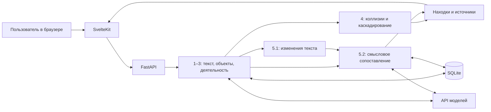

# la(rp)-peace — анализ организационной структуры и функций

**Веб-приложение для проверки реорганизации по документам «до» и «после».**
Помогает понять, какие подразделения изменились, кому переданы обязанности,
какие функции могли потеряться и где возникли дублирование или конфликт ответственности.
Каждое наблюдение можно проверить по конкретному пункту исходного документа.

Продукт предназначен для специалистов по организационному развитию, внутреннему аудиту,
кадрам и руководителей подразделений.

> **Хакатонный прототип, разработка продолжается.** Ниже описан целевой пользовательский
> сценарий, включая сравнение текста (5.1) и смысловое сопоставление (5.2).
> Подключение всех этапов к интерфейсу ещё завершается. В разделе
> [«Как проверить решение»](#как-проверить-решение) разделены демонстрация интерфейса
> и обработка собственных документов.

## Какую проблему решаем

После реорганизации недостаточно сравнить названия отделов или найти изменённые строки.
Функцию могут передать другому подразделению, переписать другими словами,
разделить между исполнителями или описать в другом документе.
Одинаковый текст также может означать другую ответственность, если изменился исполнитель.

Приложение связывает три уровня: **изменение документа → изменение структуры →
изменение распределения работы**. Специалист получает список вопросов для проверки
с подтверждениями из обеих редакций.

## Что реализовано сейчас

- Загрузка документов, извлечение текста и структуры, хранение оригиналов и результатов в SQLite.
- Серверные этапы выделения объектов и деятельности, проверки коллизий и каскадирования,
  сравнения текста (5.1) и смыслового сопоставления (5.2).
- Веб-интерфейс загрузки, просмотра структуры, реестров объектов и деятельности, сравнения текстов.
- Демонстрационный экран анализа с находками, источниками и ручной проверкой выводов.

Наличие отдельных этапов ещё не означает готовность всего сценария в браузере:
интеграция результатов сравнения с общим экраном анализа продолжается.

## Пользовательский путь

### 1. Загрузить документы

Пользователь добавляет старую и новую редакции либо комплекты документов:
положения о подразделениях, должностные инструкции, приказы и приложения,
внутренние нормативные документы, текстовые или табличные оргструктуры.

Поддерживаемые форматы: **DOCX, PDF с текстовым слоем, XLSX**.
Для первой проверки достаточно двух редакций одного положения.

### 2. Проверить, что сравнивается

Перед анализом пользователь проверяет стороны **«До»** и **«После»**:
названия документов, редакции, организацию и даты.
Если принадлежность документов или порядок редакций неоднозначны,
система предлагает подтвердить выбор.

В текущем экране загрузки стороны задаются через две области «До» и «После».
Нажатие **«Начать анализ»** открывает экран обработки.

### 3. Дождаться обработки

Система последовательно:

1. Извлекает текст, разделы, пункты, таблицы и реквизиты.
2. Определяет подразделения, должности, роли и организационные связи.
3. Выделяет функции, обязанности, права и запреты с условиями и сроками.
4. Проверяет дублирование, потенциальные конфликты и распределение функций по уровням.
5. Сопоставляет редакции и собирает результаты с источниками.

Пользователь видит ход обработки и замечания. Если данных недостаточно,
результат получает отметку **«Требует проверки»**.

### 4. Посмотреть изменения текста — этап 5.1

На экране **«Изменения → Word»** две редакции показаны рядом.
Пользователь видит добавленный и удалённый текст, изменённые формулировки,
перенумерованные и перенесённые пункты.

Сопоставление учитывает содержание: пункт 4.1 может соответствовать пункту 6.5.
Разделение одного пункта на несколько и объединение пунктов показываются
как связанные изменения. Из каждого фрагмента можно перейти к его источнику.

### 5. Понять, что изменилось по смыслу — этап 5.2

В представлении **«Изменения → Визуал»** пользователь изучает связи между
подразделениями и их деятельностью «до» и «после»:

- какие объекты сохранились, сменили название, принадлежность или роль;
- где есть основания говорить об объединении или разделении;
- какие функции сохранились и кому они теперь закреплены;
- какие обязанности изменились частично — например, срок, периодичность или условие;
- где добавился ещё один исполнитель;
- какая деятельность не получила найденного соответствия в другой редакции.

Поиск выходит за пределы прежнего подразделения и одного документа.
Перенос функции из положения в должностную инструкцию также входит в область сравнения.

**Удаление пункта не считается автоматически потерей функции.**
Если после проверки закрепление не найдено, система показывает возможную потерю
в пределах предоставленных документов. Создание и упразднение подразделений
также требуют подтверждения источниками.

### 6. Проверить проблемные места и доказательства

На странице **«Анализ»** пользователь рассматривает возможные потери функций,
дублирование и конфликты интересов. Дополнительно проверяет, как функции
верхнего уровня распределены между подчинёнными подразделениями и должностями.

При выборе находки открывается её доказательная база: исходные формулировки,
документы, пункты, объяснение сопоставления и оставшиеся вопросы.
Пользователь переходит по цитате к тексту, сверяет контекст
и отмечает вывод кнопкой **«Подтвердить»** или **«Отклонить»**.

### 7. Получить итог анализа

Сводка и аналитическое заключение помогают ответить на три вопроса:
**что изменилось, какие риски требуют внимания и что проверить ответственному сотруднику**.

Результат — карта изменений с источниками и проверяемые наблюдения.
Решение об изменении оргструктуры или распределении обязанностей принимает человек.

## Как запустить

Нужны **Python 3.12**, **uv**, **Node.js 24** и **Corepack**
для запуска закреплённой в проекте версии pnpm.
Для обработки новых документов также нужны интернет и доступ к API модели.

### 1. Получить проект и установить backend

```bash
git clone https://github.com/BAITC-Hacks/hack-977e5070-la-rp--peace.git
cd hack-977e5070-la-rp--peace
uv sync --locked
```

### 2. Настроить модель

Скопируйте [.env.example](.env.example) в `.env` в корне проекта:

```powershell
# Windows PowerShell
Copy-Item .env.example .env
```

```bash
# Linux / macOS
cp .env.example .env
```

Заполните в `.env`:

| Переменная | Что указать |
|---|---|
| `OPENAI_API_KEY` | Ключ доступа к API |
| `OPENAI_MODEL` | Имя доступной модели, поддерживающей используемый JSON-режим |
| `OPENAI_EMBEDDING_MODEL` | Модель эмбеддингов; по умолчанию `text-embedding-3-large` |
| `OPENAI_BASE_URL` | Только при использовании другого OpenAI-совместимого сервиса |

Конкретная модель для текстового анализа не задана по умолчанию.
Если она не принимает `reasoning_effort`, оставьте `OPENAI_REASONING_EFFORT` пустым.
API-ключ хранится на backend; передавать его в настройки frontend не нужно.

### 3. Запустить backend — первый терминал

Из корня проекта:

```bash
uv run uvicorn la_rp_peace.api.app:create_app --factory --reload
```

Проверка доступности: [localhost:8000/api/health](http://localhost:8000/api/health).
Документация API для разработчиков: [localhost:8000/docs](http://localhost:8000/docs).

### 4. Запустить веб-приложение — второй терминал

Из корня проекта:

```bash
cd frontend
corepack pnpm install --frozen-lockfile
corepack pnpm dev
```

Откройте **[http://localhost:5173](http://localhost:5173)** — это пользовательский
интерфейс для демонстрации жюри.

По умолчанию frontend обращается к `http://localhost:8000`.
Если backend работает по другому адресу, задайте `PUBLIC_API_URL`
в `frontend/.env` по примеру [frontend/.env.example](frontend/.env.example)
и настройте `CORS_ORIGINS` на backend.

Данные сохраняются локально в SQLite: `data/larp.sqlite3`.
После остановки приложения загруженные оригиналы и сохранённые результаты остаются в базе.

## Как проверить решение

### Быстро познакомиться с интерфейсом

Для демонстрационного примера достаточно запустить frontend; ключ модели не нужен.

1. Откройте [пример анализа](http://localhost:5173/analyses/demo/changes).
2. На странице «Изменения» выберите находку и откройте её доказательства.
3. Перейдите по цитате к соответствующему пункту.
4. Откройте страницу «Анализ» и изучите карточки потерь, дублирования и конфликтов.
5. Поставьте отметку «Подтвердить» или «Отклонить».

**Этот режим использует подготовленную демонстрационную фикстуру**
из [frontend/src/lib/fixtures/result.json](frontend/src/lib/fixtures/result.json).
Она показывает пользовательский путь и представление результатов;
это не результат анализа загруженных вами файлов.

### Проверить обработку реальных документов

Запустите оба сервера и настройте доступ к модели.

1. На главной странице загрузите в «До»
   [положение о внутреннем аудите, редакция 8](test_data/Положение_о_внутреннем_аудите_редакция_8_обезличено.docx).
2. В «После» загрузите
   [редакцию 9](test_data/Положение_о_внутреннем_аудите_редакция_9_обезличено.docx).
3. Нажмите **«Начать анализ»** и дождитесь обработки.
4. В текущем интерфейсе после парсинга открывается структура документа.
   Проверьте реквизиты, разделы, пункты и замечания обработки.
5. Откройте сравнение текстов и найдите пункт 3.4 с описанием подразделений.
   Сверьте показанные фрагменты с исходными файлами.
6. Проверьте переход к источнику и скачивание оригинала.

Подключение результатов backend 5.1/5.2 к общему экрану анализа ещё завершается.
Поэтому текущая загрузка не должна восприниматься как переход к полностью готовому
семантическому отчёту: его целевой пользовательский путь показан в деморежиме выше.
Готовность следующих этапов следует проверять отдельно от завершения парсинга.

Для проверки без повторных вызовов модели доступен
[снимок базы и инструкция восстановления](snapshots/stages-1-3-wip/README.md).
Это отдельный зафиксированный результат этапов 1–2; завершённого этапа 3 в нём нет.

## Технологии и архитектура

| Часть решения | Технологии |
|---|---|
| Веб-интерфейс | SvelteKit, Svelte 5, TypeScript, Tailwind CSS |
| Сервер и HTTP API | Python 3.12, FastAPI, Uvicorn |
| Чтение документов | python-docx, PyMuPDF, openpyxl |
| Хранение | SQLite, SQLAlchemy 2 |
| Проверка данных | Pydantic, проверки структуры и цитат |
| ИИ и поиск соответствий | OpenAI-совместимый Chat Completions API, embeddings API, NumPy |
| Инструменты разработки | uv, pnpm, Ruff, mypy, pytest, Vitest, Playwright |



Основные каталоги: `frontend/` — интерфейс; `src/la_rp_peace/` — backend;
`methodology/` — методология; `test_data/` — контрольные документы;
`tests/` — автоматические проверки.

Локальный запуск не означает полностью локальную AI-обработку:
извлечённый текст и данные для сопоставления передаются настроенному API модели.
Встроенных интеграций с кадровой системой или СЭД нет.

## Ограничения прототипа

- Рабочая область — текст и таблицы в DOCX, текстовых PDF и XLSX.
  OCR, сканы, изображения и графические оргсхемы не поддерживаются.
- Старые `.doc` и `.xls` нужно предварительно преобразовать.
  Лимит загрузки по умолчанию — 20 МБ на файл.
- Результаты относятся к предоставленным документам. Неполный комплект
  или ошибка извлечения ограничивают достоверность выводов.
- Совпадение формулировок и высокий балл сходства сами по себе не доказывают
  одинаковую ответственность. Неоднозначные случаи требуют проверки.
- Публичная deployed-версия в репозитории не указана; демонстрация рассчитана
  на локальный запуск.
- Авторизация и разграничение доступа не реализованы.

## Документация и проверки

Методология:
[1 — парсинг](methodology/01_document_parsing.md) ·
[2 — объекты](methodology/02_entity_extraction.md) ·
[3 — деятельность](methodology/03_activity_extraction.md) ·
[4.1 — коллизии](methodology/04_1_function_collisions.md) ·
[4.2 — каскадирование](methodology/04_2_function_cascade.md) ·
[5.1 — изменения текста](methodology/05_1_document_diff.md) ·
[5.2 — смысловое сопоставление](methodology/05_2_semantic_comparison.md).

Проверки backend без реальных вызовов модели:

```bash
uv run pytest -q
```

Проверка типов и сборки frontend, из `frontend/`:

```bash
corepack pnpm check
corepack pnpm build
```

Команда **la(rp)-peace**, HackAlem AI.
