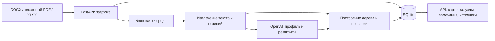

# la(rp)-peace — ИИ-агент анализа организационной структуры и функционала

> **WIP: проект в разработке.** В этой версии реализован backend первого этапа:
> загрузка и структурный разбор документов с проверяемыми ссылками на исходный текст.
> Извлечение организационных объектов и деятельности описано в методологии.
> Полное сравнение «до / после» и аналитическое заключение пока не входят в доступный сценарий.

## 1. О проекте

При реорганизации нужно сопоставить положения о подразделениях, должностные инструкции,
организационные структуры и распорядительные документы: какие подразделения изменились,
кому переданы функции и не возникли ли потери или дублирование обязанностей.

Проект команды **la(rp)-peace** для HackAlem AI предназначен для сотрудников, которые
анализируют организационную структуру и распределение функций. Цель решения — подготовить
объяснимый анализ с подтверждением выводов конкретными фрагментами документов.

Текущая версия решает первый шаг этой задачи: превращает текст документов в дерево
разделов и пунктов, извлекает реквизиты и сохраняет привязку к оригиналу.
Она ещё не определяет изменения подразделений или потерянные функции.

## 2. Что реализовано

| Возможность | Текущее состояние |
|---|---|
| Загрузка документов | HTTP API принимает `.docx`, `.pdf`, `.xlsx`; лимит по умолчанию — 20 МБ на файл |
| Группировка входных данных | Метки `before` («до»), `after` («после»), `regulatory` (нормативные), `benchmark` (для сопоставления с другими организациями) |
| Извлечение содержимого | Текст, абзацы и таблицы Word; текстовый слой PDF; строки и ячейки Excel |
| Структурный разбор | ИИ предлагает профиль разметки; код применяет его к тексту и строит дерево разделов, пунктов, списков и служебных блоков |
| Карточка документа | Название, тип, организация, редакция, сведения об утверждении и даты — при наличии подтверждения в тексте |
| Проверки результата | Проверка профиля, структуры, диапазонов текста и цитат; замечания доступны через API |
| Прослеживаемость | Путь к пункту, цитата, контекст и доступная позиция в исходном файле |
| Работа с документами | Список и карточка, исправление типа, скачивание оригинала, удаление |
| Фоновая обработка | Очередь внутри процесса API; получение текущего статуса документа |
| Хранение | SQLite: оригиналы файлов, реквизиты, текст, профиль, узлы дерева и замечания |

Метки «до» и «после» сейчас группируют документы. Их загрузка **не запускает сравнение функций**.

Дальнейшие этапы описаны отдельно:

- [Этап 1 — парсинг документов](methodology/01_document_parsing.md).
- [Этап 2 — извлечение организационных объектов и связей](methodology/02_entity_extraction.md).
- [Этап 3 — извлечение деятельности организационных объектов](methodology/03_activity_extraction.md).

Пользовательский интерфейс предусмотрен как веб-приложение на SvelteKit.
В текущем срезе репозитория каталог `frontend/` содержит документацию и
[задание на интеграцию](frontend/HANDOFF.md); исходников приложения и `package.json` нет.
Доступный способ работы в браузере — интерактивная документация API.

## 3. Как работает решение

1. Пользователь загружает документ и указывает его группу, например «до» или «после».
2. API сохраняет оригинал, размер, формат и контрольную сумму SHA-256, затем ставит
   документ в очередь. Ответ на загрузку — HTTP `202`.
3. Адаптер формата извлекает текст и карту позиций: абзац для Word, страницу для PDF,
   лист, строку и столбец для Excel.
4. Языковая модель получает текстовое представление документа и предлагает реквизиты
   и профиль разбора: правила распознавания разделов, пунктов и вложенности.
5. Код проверяет ответ, строит дерево по полному извлечённому тексту и проверяет
   подтверждающие цитаты. При замечаниях модель получает обратную связь;
   число дополнительных попыток ограничено настройками.
6. Пользователь получает карточку, дерево документа и замечания. Через API можно
   проверить цитату, увидеть её контекст и скачать оригинал.

Статусы обработки:

| Статус | Значение |
|---|---|
| `pending` | Разбор ещё не завершён |
| `validated` | Нет открытых блокирующих замечаний; неблокирующие замечания возможны |
| `needs_review` | Есть блокирующие замечания либо произошла ошибка извлечения или обращения к модели |

`validated` означает прохождение проверок парсинга, а не подтверждение правильности
будущих выводов об организационной структуре.

## 4. Технологии

| Компонент | Технологии в репозитории |
|---|---|
| Язык и окружение | Python 3.12, `uv`, Hatchling |
| HTTP API | FastAPI, Uvicorn, `python-multipart` |
| Данные и настройки | SQLAlchemy 2, SQLite, Pydantic, `pydantic-settings` |
| Чтение документов | `python-docx`, PyMuPDF, `openpyxl` |
| ИИ | OpenAI Python SDK, Chat Completions API с JSON-ответом |
| Разбор по профилю | Библиотека `regex`, ограничение времени выполнения регулярных выражений |
| Журналирование | `structlog` |
| Проверки разработки | pytest, Ruff, mypy |
| Запланированный frontend | SvelteKit / Svelte 5, TypeScript, Tailwind CSS; описаны в [спецификации](.agents/frontend.md) |

**Конкретная AI-модель не зафиксирована.** Её имя задаётся через `OPENAI_MODEL`.
Можно указать другой OpenAI-совместимый адрес через `OPENAI_BASE_URL`;
совместимость конкретного сервиса необходимо проверять отдельно.

Зависимости и их ограничения заданы в [pyproject.toml](pyproject.toml),
зафиксированные версии — в [uv.lock](uv.lock).

## 5. Архитектура

Ниже показан реализованный путь обработки первого этапа.



| Путь | Назначение |
|---|---|
| `src/la_rp_peace/api/` | HTTP-маршруты документов, источников и проверки доступности |
| `src/la_rp_peace/ingestion/extract/` | Адаптеры DOCX, PDF и XLSX |
| `src/la_rp_peace/ingestion/` | Вызов модели, профиль разбора, дерево, реквизиты, проверки и очередь |
| `src/la_rp_peace/sources.py`, `quotes.py`, `navigation.py` | Проверка цитат и навигация к исходным фрагментам |
| `src/la_rp_peace/config.py`, `db.py`, `models.py`, `schema.sql` | Настройки, подключение к SQLite и схема данных |
| `methodology/` | Методология трёх этапов |
| `tests/` | Автоматические проверки и подготовленные ответы модели |
| `test_data/` | Обезличенные документы для проверки и демонстрации |
| `frontend/` | Документация по будущему пользовательскому интерфейсу |

Сервер базы данных, Redis и отдельный сервис очереди для текущего запуска не нужны.
Фоновые задания выполняются в процессе API. Данные по умолчанию хранятся
в `data/larp.sqlite3`; база создаётся при запуске приложения.

## 6. Установка и запуск

### Требования

- Git.
- Python 3.12 и установленный `uv`.
- Для реального разбора — доступ к API модели, ключ и имя доступной модели.
- Интернет для установки зависимостей и обращения к внешнему API.

### Шаг 1. Получить проект

```bash
git clone https://github.com/BAITC-Hacks/hack-977e5070-la-rp--peace.git
cd hack-977e5070-la-rp--peace
uv sync --locked
```

### Шаг 2. Настроить окружение

Создайте `.env` из [.env.example](.env.example).

Linux / macOS:

```bash
cp .env.example .env
```

Windows PowerShell:

```powershell
Copy-Item .env.example .env
```

В `.env` заполните `OPENAI_API_KEY` своим ключом и `OPENAI_MODEL` именем модели,
доступной в используемом API. Репозиторий не задаёт модель по умолчанию.

Основные настройки:

| Переменная | По умолчанию | Назначение |
|---|---|---|
| `OPENAI_API_KEY` | Не задана | Ключ API |
| `OPENAI_MODEL` | Не задана | Имя модели |
| `OPENAI_BASE_URL` | Не задана | Альтернативный OpenAI-совместимый endpoint |
| `OPENAI_REASONING_EFFORT` | `low` | Параметр рассуждения; оставьте пустым, если модель его не поддерживает |
| `DATABASE_URL` | `sqlite:///data/larp.sqlite3` | Файл базы |
| `MAX_UPLOAD_MB` | `20` | Лимит размера файла |
| `PARSER_WORKERS` | `2` | Число параллельных обработчиков |
| `PROFILE_MAX_CHARS` | `150000` | Порог, после которого модель получает выборку фрагментов |
| `PROFILE_RETRIES` | `2` | Дополнительные попытки исправить профиль |
| `CORS_ORIGINS` | `["http://localhost:5173"]` | Разрешённые адреса браузерного клиента |

Без ключа и модели сервер запускается, но загрузка документов возвращает HTTP `503`.
Файл `.env` исключён из Git.

### Шаг 3. Запустить API

Выполните из корня проекта:

```bash
uv run uvicorn la_rp_peace.api.app:create_app --factory --reload
```

Откройте:

- [Интерактивную документацию API](http://localhost:8000/docs) — загрузка и проверка документов.
- [Проверку доступности](http://localhost:8000/api/health) — ожидаемый ответ `{"status":"ok"}`.

Команда запуска SvelteKit пока не приводится: исполняемый frontend в этой ветке отсутствует.

## 7. Как проверить решение: сценарий для жюри

Этот сценарий демонстрирует **разбор и прослеживаемость документов**, а не готовое
сравнение подразделений или функций. Для него нужен настроенный API модели.

### Загрузить две редакции

1. Откройте `http://localhost:8000/docs`.
2. В `POST /api/documents` нажмите **Try it out**.
3. Укажите `set=before` и выберите
   [редакцию 8](test_data/Положение_о_внутреннем_аудите_редакция_8_обезличено.docx).
4. Выполните запрос и сохраните возвращённый `id`.
5. Повторите загрузку с `set=after` для
   [редакции 9](test_data/Положение_о_внутреннем_аудите_редакция_9_обезличено.docx).
6. Через `GET /api/documents/{document_id}` проверяйте каждый документ, пока
   `parse_status` не сменится с `pending` на `validated` или `needs_review`.

ID выдаются базой; используйте значения из своих ответов API.

### Посмотреть результат и его источник

1. Откройте `GET /api/documents/{document_id}/nodes` для редакции 9.
   Ответ содержит узлы с `parent_id`, текстом, путём к пункту и позицией в оригинале.
2. Найдите текст с **«ДИТААД»** в пункте 3.4 и скопируйте ID соответствующего узла.
3. В `POST /api/sources/resolve` укажите этот ID как `node_id`,
   а строку `ДИТААД` — как `quote`. Проверьте документ, путь, цитату и контекст в ответе.
4. Повторите запрос с цитатой `ДИТ ААД`: проверка должна отклонить несовпадающий
   текст с HTTP `422`.
5. Через `GET /api/documents/{document_id}/file` скачайте оригинал и найдите тот же фрагмент.
6. Посмотрите `GET /api/documents/{document_id}/profile`: профиль разбора
   и текстовые подтверждения реквизитов доступны для проверки.

Дополнительно загрузите PDF редакции 9 из [test_data/converted](test_data/converted)
и проверьте наличие номера страницы в `location`.

Если документ имеет статус `needs_review`, откройте
`GET /api/documents/{document_id}/issues`. Там находятся причины: например,
ошибка модели, невозможность извлечь текст или замечания к структуре.
При ошибке обращения к модели проверьте настройки и повторите загрузку.

Форма дерева при реальном вызове зависит от ответа выбранной модели.
Контрольные результаты на подготовленных ответах проверяются отдельно автоматическими тестами.

### Проверка без внешнего API

```bash
uv run pytest -q
```

По умолчанию тесты с маркером `live` исключены. Основной набор использует подготовленные
ответы модели из `tests/fixtures/profiles/` и не требует API-ключа.
Он проверяет извлечение текста, построение дерева, реквизиты, цитаты, хранение и HTTP API.
Это проверка логики обработки, а не измерение качества живой модели.

Отдельный запуск с реальными вызовами модели:

```bash
uv run pytest -q -m live
```

Он требует настроенного доступа и расходует ресурсы используемого API.
Проверки форматирования, стиля и типов:

```bash
uv run ruff format --check .
uv run ruff check .
uv run mypy .
```

## 8. Данные и интеграции

- **Входные данные:** файлы пользователя в DOCX, PDF с текстовым слоем и XLSX.
  Организационная структура должна быть выражена текстом или таблицей с явными связями.
- **Контрольные документы:** две обезличенные редакции положения о внутреннем аудите
  в `test_data/` и их PDF-версии в `test_data/converted/`.
  Простые таблицы Word и Excel также создаются внутри тестов.
- **Внешняя интеграция:** OpenAI API либо настроенный совместимый endpoint.
  Модели передаются извлечённый текст или его выборка, инструкции и замечания проверок.
- **Локальное хранение:** оригиналы и результаты разбора сохраняются в SQLite.
  Локальный запуск сервера не означает, что обработка моделью выполняется локально.
- **Другие системы:** подключений к кадровым системам, СЭД, корпоративным справочникам
  и внешним нормативным базам в текущем коде нет.

## 9. Ограничения текущей версии

- **Последующие этапы.** В доступном API нет извлечения организационных объектов
  и деятельности, сравнения «до / после», поиска потерянных и дублирующихся функций,
  конфликтов интересов, итогового заключения и его экспорта.
  Методология не равнозначна реализованной функции.
- **Интерфейс.** Отдельное пользовательское веб-приложение пока не включено
  в этот срез репозитория; демонстрация проводится через Swagger UI.
- **Только текст и таблицы.** OCR, изображения, SmartArt и связи в графических
  оргсхемах не обрабатываются. PDF без извлекаемого текста получает
  `needs_review` с блокирующим замечанием после загрузки.
  Полнота извлечения смешанных PDF с текстовыми и сканированными страницами
  отдельно не проверяется.
- **Форматы.** Старые `.doc` и `.xls` не поддерживаются: нужна предварительная
  конвертация в `.docx` и `.xlsx`. Формулы Excel читаются по сохранённым значениям;
  визуальное оформление и объединение ячеек не интерпретируются как иерархия.
- **Границы документов.** Документы обрабатываются независимо. Ссылки на отдельные
  файлы приложений не означают автоматическую загрузку или связывание их содержимого.
- **Область проверки.** Основные реальные примеры — редакции одного положения;
  качество на всех видах должностных инструкций, приказов и оргструктур
  по этим примерам не установлено.
- **Зависимость от модели.** Для реального разбора нужен API. Для больших документов
  профиль строится по выборке; результат может требовать ручной проверки.
- **Эксплуатация.** Нет авторизации, разграничения доступа и миграций базы данных.
  Очередь работает внутри одного процесса приложения.

## 10. Развёрнутая версия

Подтверждённая ссылка на публичную deployed-версию в репозитории отсутствует.
Для демонстрации используйте локальный запуск и
[Swagger UI](http://localhost:8000/docs).

## 11. Команда и документация

**Команда:** la(rp)-peace.

- [Методология парсинга](methodology/01_document_parsing.md).
- [Методология извлечения организационных объектов](methodology/02_entity_extraction.md).
- [Методология извлечения деятельности](methodology/03_activity_extraction.md).
- [Описание backend](.agents/backend.md).
- [Требования к frontend](.agents/frontend.md).
- [Передача задачи по веб-приложению и демонстрации](frontend/HANDOFF.md).

Документы с планами развития могут описывать функции, которых ещё нет в коде.
При оценке доступных возможностей ориентируйтесь на статус WIP и сценарий проверки выше.
